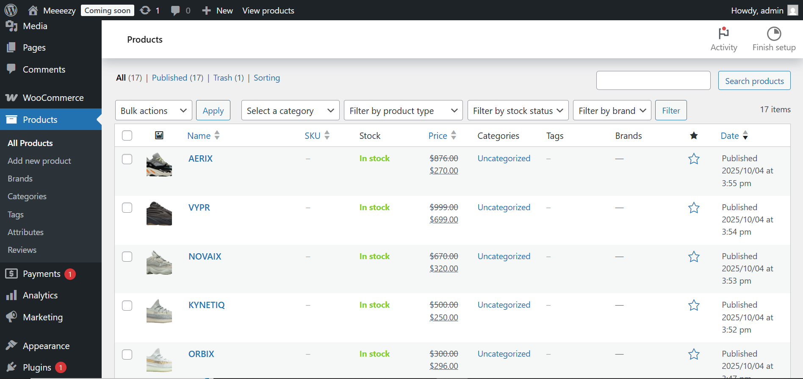
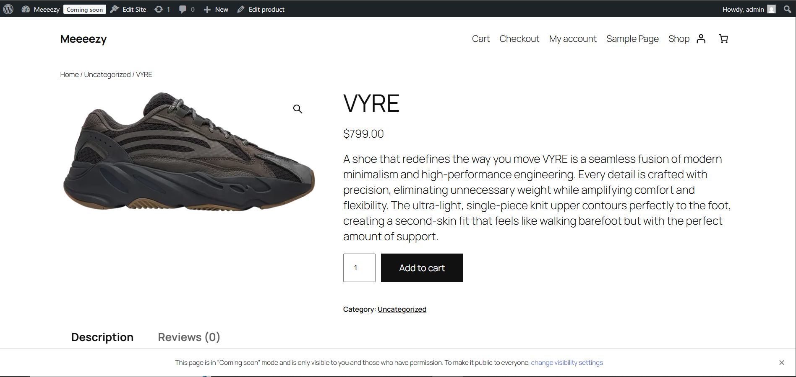
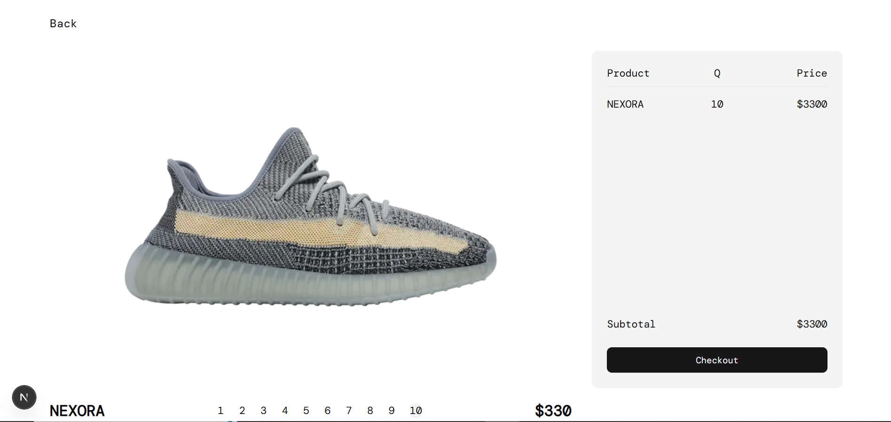
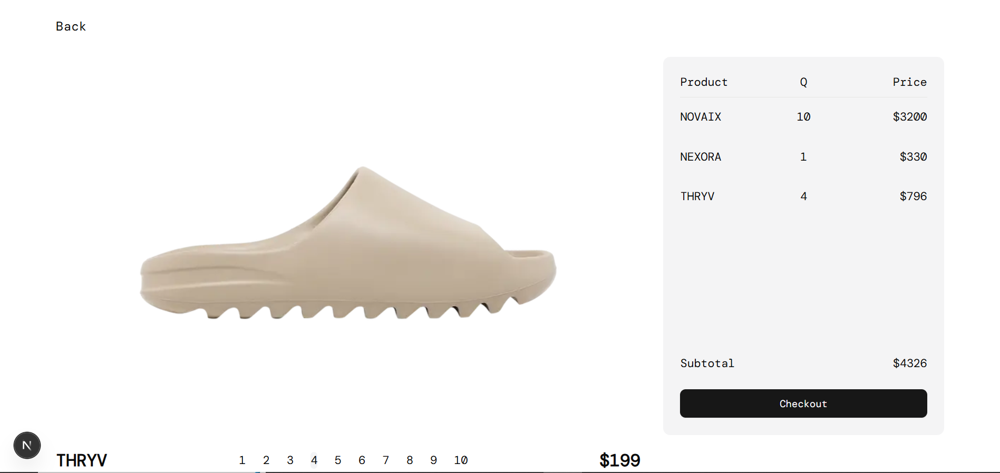
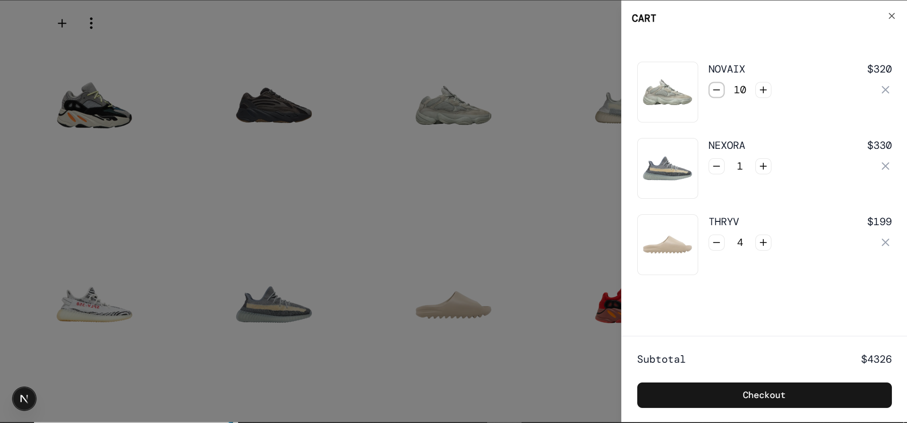
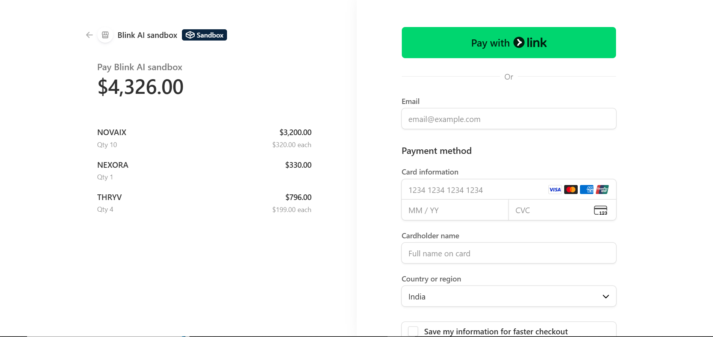

## 🧢 Meeeezy.com — Full-Stack Clone of Yeezy.com

A modern, full-featured clone of the official **Yeezy.com** platform — built with **Next.js 15**, **WordPress Headless CMS (WooCommerce)**, and **Stripe payments**.

### 🚀 Tech Stack

- **Frontend:** Next.js 15 (TypeScript, Tailwind CSS, shadcn/ui)  
- **Backend:** WordPress (Headless setup) with WooCommerce plugin  
- **Payments:** Stripe  
- **Hosting:** Local / Local WP (Rapyd Cloud integration planned)

### 🖼️ Project Preview

### 🛍️ Product Images (From WordPress / WooCommerce)

### 💻 Frontend UI (Next.js Screens)

### 💳 Stripe Checkout / Payments

### 🧩 Features

- Headless WordPress integration with Next.js  
- Real-time WooCommerce product fetching  
- Fully responsive and pixel-perfect UI  
- Secure Stripe checkout flow  
- Modern UI components built with shadcn/ui  